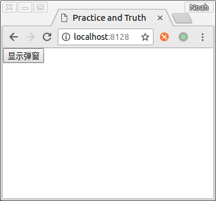

### 一. 先写一个普通的vue组件

文件位置 `/src/toast/toast.vue`

    <template>
      
我是弹窗

    </template>
    
### 二. 在我们需要使用的页面引入组件,方便看效果和错误

    <template>
      

          <toast></toast>
      

    </template>
    
    

### 三. 实现动态加载组件

可以看到,已经显示出一个静态的弹出层了,接下来我们就来看看如何实现动态弹出.  

我们先在 `/src/toast/` 目录下面,新建一个`index.js`, 然后在index.js里面,敲入以下代码(由于该代码耦合比较严重,所以就不拆开一行一行讲解了,改成行内注释)

文件位置 `/src/toast/index.js`

    import vue from 'vue'

    // 这里就是我们刚刚创建的那个静态组件
    import toastComponent from './toast.vue'

    // 返回一个 扩展实例构造器
    const ToastConstructor = vue.extend(toastComponent)

    // 定义弹出组件的函数 接收2个参数, 要显示的文本 和 显示时间
    function showToast(text, duration = 2000) {

      // 实例化一个 toast.vue, 并且传入参数
      const toastDom = new ToastConstructor({
        el: document.createElement('div'),
        data() {
          return {
            text:text,
            show:true
          }
        }
      })

      // 把 实例化的 toast.vue 添加到 body 里
      document.body.appendChild(toastDom.$el)

      // 过了 duration 时间后隐藏
      setTimeout(() => {toastDom.show = false} ,duration)
    }

    // 注册为全局组件的函数
    function registryToast() {
      // 将组件注册到 vue 的 原型链里去,
      // 这样就可以在所有 vue 的实例里面使用 this.$toast()
      vue.prototype.$toast = showToast
    }

    export default registryToast

> 附一个传送门 [vue.extend 官方文档](https://cn.vuejs.org/v2/api/#Vue-extend)

然后,在vue的入口文件(脚手架生成的话是`./src/main.js`) 注册一下组件

文件位置 `/src/main.js`

    import toastRegistry from './toast/index'

    // 这里也可以直接执行 toastRegistry()
    Vue.use(toastRegistry)

最后,我们稍微修改一下使用方式,把`第二步` 的引用静态组件的代码,改成如下

    <template>
      

        <input type="button" value="显示弹窗" @click="showToast">
      

    </template>

    

<!--  -->
<!--  -->
<!--  -->

可以看到,我们已经`不需要`在页面里面`引入`跟`注册`组件,就可以直接使用`this.$toast()`了.

现在我们已经初步实现了一个弹窗.